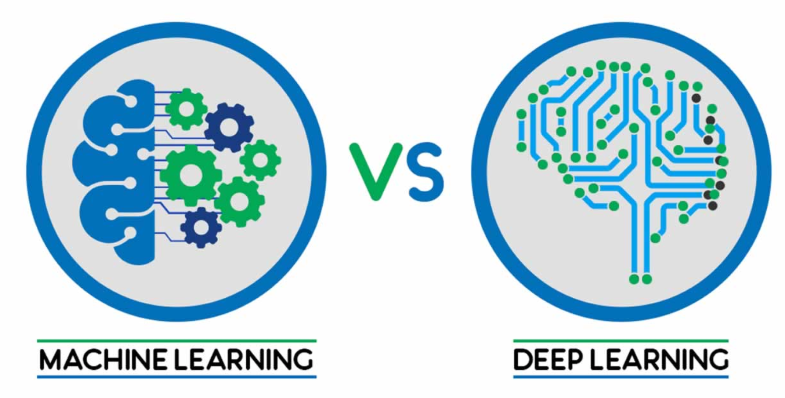

# Customer Analysis and Exit Prediction

### What is a customer churn problem?
Simply put, customer churn occurs when customers or subscribers stop doing business with a company or service. Also known as customer attrition, customer churn is a critical metric because it is much less expensive to retain existing customers than it is to acquire new customers – earning business from new customers means working leads all the way through the sales funnel, utilizing your marketing and sales resources throughout the process. Customer retention, on the other hand, is generally more cost-effective as you’ve already earned the trust and loyalty of existing customers.

### What causes customer churn in banking?
There are a multitude of issues that can lead customers to leave a business, but there are a few that are considered to be the leading causes of customer churn. The first is poor customer service. One study found that nearly nine out of ten customers have abandoned a business due to a poor experience. Other reasons may include the lack of availability of latest technology (e.g. online banking, bank application), problems related to the actual products and services offered such as accounts which offer too low interest rates, and last but not least location itself can cause customers leaving the bank.

### Our problem :
We use a sample of 10,000 customers of a bank and their personal credit-related data to create a demographic centric model which predicts which of the customers are at highest risk of leaving the bank. The data is fictional since datasets containing this kind of information are prohibited for public usage. In our scenario, we obtained the data by monitoring the customers for the past 6 months and recorded whether they exited or not.

### Our approach :
We will use Tableau to create a number of graphical representions of our data that will hand us valuable insight about our customers and the specific dataset. These representations will include distributions, mappings and rigorous A/B tests designed to give us a better understanding of our problem and shift our focus to the variables that need more attention.

After we have our visual analysis, we will create a forecasting model which will try to predict whether a customer is going to exit the bank or not. We will use this opportunity to test a different set of algorithms.

### Machine learning VS Deep learning

After we obtain the final results from our -traditional- machine learning model we will switch to deep learning and compare the results with the prediction of an Artificial Neural Nework. In theory Machine Learning is a general category which encompasses Deep Learning, but we will use the "Machine Learning vs Deep learning" convention to describe the difference between the well known traditional algorithms and the newer ones which are based on neurons and try to immitate the functionality of human brain. 

Let's jump to the [Jupyter Notebook](https://github.com/giorgosterz/Customer_Analaysis_and_Predicitve_Modeling/blob/master/Churn%20Problem%20Visualization.ipynb) to get started!

*Sources*: 
- *https://www.ngdata.com/what-is-customer-churn/* 
- *https://www.slideshare.net/BU_Research_Methods/customer-churn-prediction-in-banking*
- *https://morioh.com/p/7ff324bc021e*
